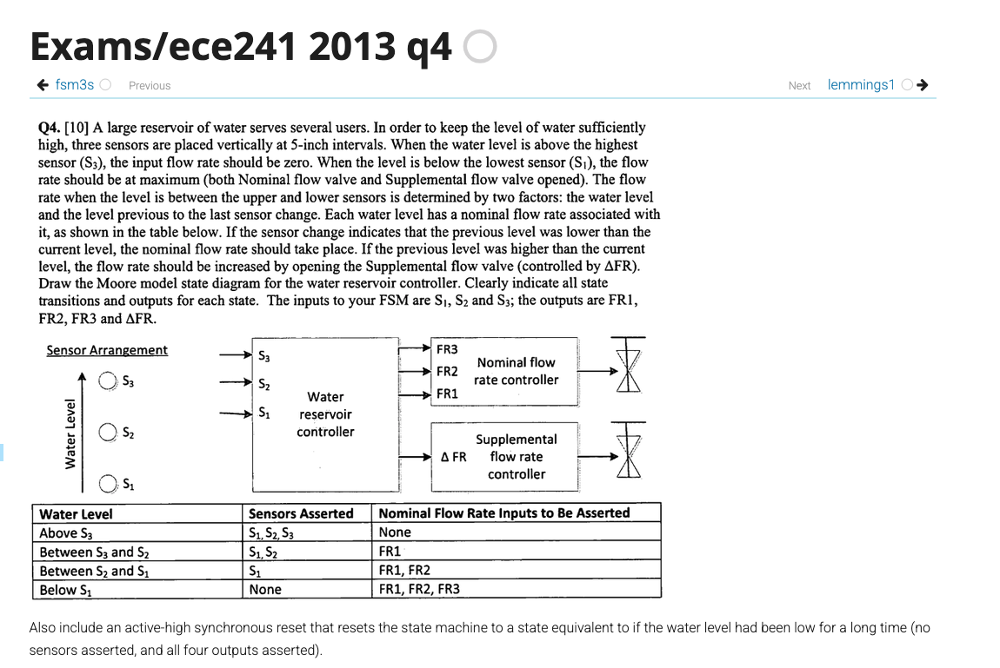

Given that hdlbit's actual answer to this question is a little too compressed and there aren't many other good resources for this specific question, I wanted to share my answer to anyone that might need help on this question. 
My code is written to be intuitive to the reader so they can see the logic easier than hdlbit's given solution. 

